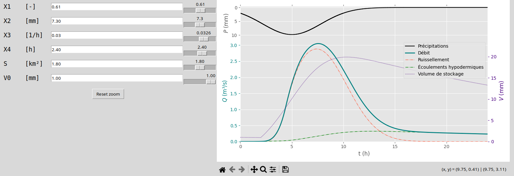
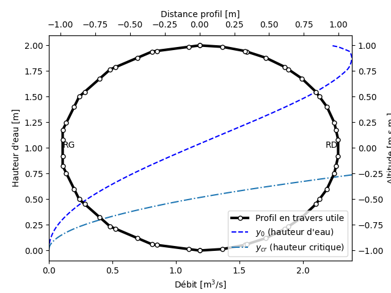
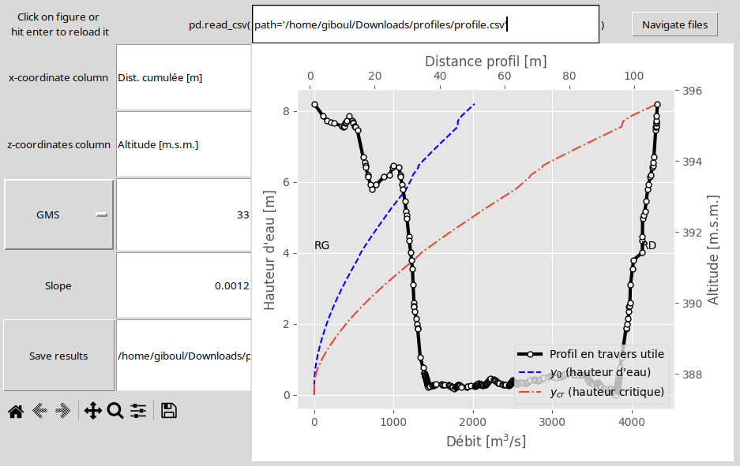
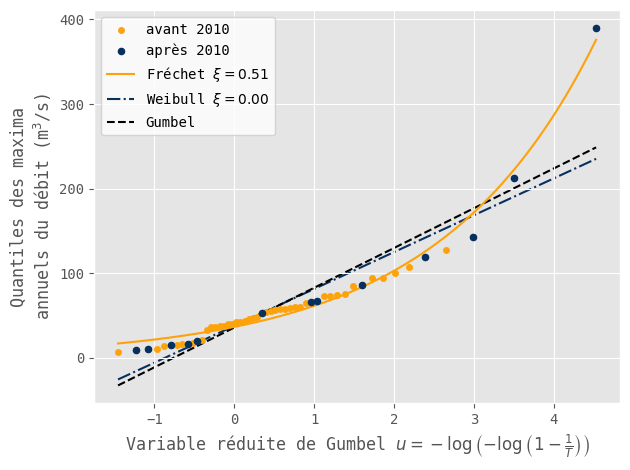

# hydrogibs

Small hydrology package created for the sake of class projects with [Christophe Ancey](https://fr.ancey.ch/ "fr.ancey.ch") and Giovanni De Cesare.

The only module that's currently usable is the GR4 model containing:

## A Catchment object:

`Catchment(X1, X2, X3, X4, surface=1, initial_volume=0)` with

* X1 within [0,1]
* X2 [mm]
* X3 within [0,1]
* X4 [h]
* surface [km^2]
* initial_volume [mm]

### Preset catchments:

* Defined as `Laval(X1=57.6/100, X2=7.8, X3=2.4/100, X4=0.38, *args, **kwargs)`, the available presets (listed in the `presets` dictionary) are:
  * Laval
  * Erlenbach
  * Rimbaud
  * Latte
  * Sapine
  * Rietholzbach
  * Lumpenenbach
  * Vogelbach
  * Brusquet

## A rain object

 `Rain(time: numpy.ndarray, rainfall: numpy.ndarray)`

A block rain (rainfall = intensity if t < duration else 0): `BlockRain(intensity: float, duration: float)`

## An app to goof around with all parameters

 `App(catchment, rain)`



# Hydraulic profiles

```hydrogibs.fluvial.canal.Section(x_array, z_array).plot()```



## With an app to conveninetly explore different friction laws, friction coefficients ans slopes




## Simple time series analysis



# Example file

`example.ipynb` might help you get the hang of this package
